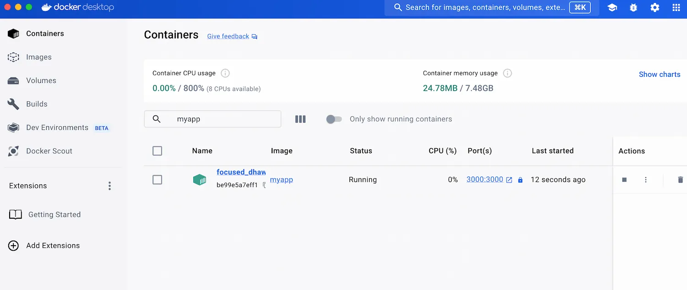
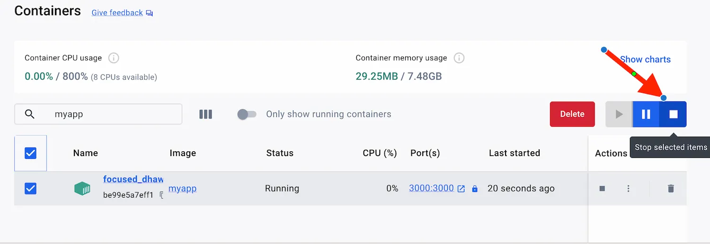
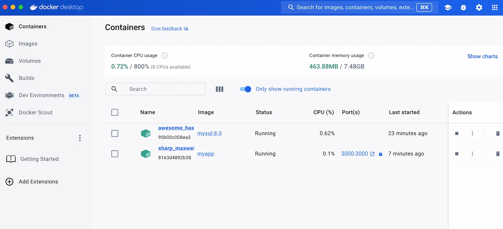

<iframe width="650" height="365" src="https://www.youtube.com/embed/nsWWQ1xoEy0?rel=0" title="YouTube video player" frameborder="0" allow="accelerometer; autoplay; clipboard-write; encrypted-media; gyroscope; picture-in-picture; web-share" allowfullscreen></iframe>

## Explanation

In this concept, you will learn the following:
- How to add database container to the application stack
- How to run multi-container applications

Traditionally, applications might be packaged with all their dependencies into a single unit. While this approach can be simple, it has limitations:

- **Scalability**: Scaling individual components like a database becomes difficult, as you'd have to scale the entire application.
- **Versioning**: Updating one component might require rebuilding the entire application, even if other components remain unchanged.
- **Maintainability**: Troubleshooting issues becomes more complex when dealing with intertwined components.

### Benefits of have separate containers

- **Microservices Architecture**: Each container acts as a self-contained microservice, promoting scalability and independent development.
- **Isolation**: Applications run in isolated environments, improving security and preventing conflicts.
- **Flexibility**: You can easily update, restart, or scale individual containers without impacting others.

## Try it now

In this hands-on, you'll see how to build a simple Node application stack and add MySQL to the existing application stack to run multi-container application stack using `docker run` CLI.

## I. Running a Single-container Application

### Setup

[Download this ZIP file](https://github.com/docker/getting-started-todo-app/blob/build-image-from-scratch/app.zip) and extract the contents into a directory on your machine.

### Step 1. Create a file named Dockerfile

Create a file named Dockerfile in the same folder as the file package.json

```diff
FROM node:20-alpine
WORKDIR /app
COPY package*.json ./
RUN yarn install --production
COPY . .
EXPOSE 3000
CMD ["node", "./src/index.js"]
```

### Step 2. Build the Image

Open a terminal in the directory containing your modified Dockerfile and run:

```console
docker build -t myapp .
```

Start the container, publishing container port `8080` to host port `5000`:

```console
docker run -p 3000:3000 myapp
```

- The first `3000` refers to the container port. This is the port that the application inside the container listens on for incoming connections. (Usually port 3000 is used for web applications, but it can be any port)
- The second `3000` refers to the host port. This is the port on your local machine that will be used to access the application running inside the container. So, by mapping container port 3000 to host port 3000, you're essentially creating a tunnel between these ports.


### Step 3. Access the Application

Assuming your application runs on port `3000` within the container, you should be able to access it from your host machine by opening a web browser and navigating to `http://localhost:3000`.

Open `Docker Desktop Dashboard` > `Containers`, choose the right container and click the ports to access the application on the browser.




### Step 4. Stopping the running container

You can stop the running container by clicking on "Stop" button on Docker Desktop dashboard. 




## II. Running a Multi-container Application

### Step 5. Creating a Docker network for MySQL container

Containers are isolated by default and cannot communicate with each other unless they share a network. We'll create a network named todo-app using the following command:

```console
 docker network create todo-app
```

### Step 6. Starting the MySQL container

```console
 docker run -d \
    --network todo-app --network-alias mysql \
    -v todo-mysql-data:/var/lib/mysql \
    -e MYSQL_ROOT_PASSWORD=secret \
    -e MYSQL_DATABASE=todos \
    mysql:8.0
```

Let's break down the options used:

- `-d`: Runs the container in detached mode.
- `--network todo-app`: Connects the container to the todo-app network.
- `--network-alias mysql`: Assigns the alias mysql within the network for easier discovery by other containers.
- `-v todo-mysql-data:/var/lib/mysql`: Mounts a volume named todo-mysql-data to the /var/lib/mysql directory inside the container. This is where MySQL stores its data, ensuring data persistence even if the container restarts.
- `-e MYSQL_ROOT_PASSWORD=secret`: Sets the MySQL root password to "secret" (replace with a strong password in production).
- `-e MYSQL_DATABASE=todos`: Creates a database named "todos" within the MySQL container.
- `mysql:8.0`: Specifies the base image as MySQL version 8.0.

### Step 7. Access MySQL Database

To confirm we have the database up and running, connect to the database and verify it connects.

```console
 docker exec -it <mysql-container-id> mysql -p
```

When the password prompt comes up, type in secret. In the MySQL shell, list the databases and verify you see the todos database.

```console
 mysql> SHOW DATBASES;
```

You should see output that looks like this:

```console
 +--------------------+
| Database           |
+--------------------+
| information_schema |
| mysql              |
| performance_schema |
| sys                |
| todos              |
+--------------------+
5 rows in set (0.00 sec)
```

Hooray! We have our todos database and it's ready for us to use!

To exit the sql terminal type exit in the terminal.


### Step 8: Running App with MySQL

The following command connects the Node application to the MySQL database: 

```console
docker run -dp 3000:3000 \
  -w /app -v "$(pwd):/app" \
  --network todo-app \
  -e MYSQL_HOST=mysql \
  -e MYSQL_USER=root \
  -e MYSQL_PASSWORD=secret \
  -e MYSQL_DB=todos \
  myapp \
  sh -c "yarn install && yarn run dev"
```




### Step 9. Verify if the database gets updated

```console
mysql> show databases;
+--------------------+
| Database           |
+--------------------+
| information_schema |
| mysql              |
| performance_schema |
| sys                |
| todos              |
+--------------------+
5 rows in set (0.00 sec)
```

Run the following query to verify if the items are written to the database.

```console
mysql> show tables;
+-----------------+
| Tables_in_todos |
+-----------------+
| todo_items      |
+-----------------+
1 row in set (0.00 sec)
```

```console
mysql> select * from todo_items;
+--------------------------------------+---------------+-----------+
| id                                   | name          | completed |
+--------------------------------------+---------------+-----------+
| 03a949cb-7a6a-4846-96a5-1569ca390d7a | Watch Netflix |         0 |
| 2275bd3d-7e4c-4c30-9436-c11cf1e20efb | Buy Grocery   |         0 |
| b32f1053-be0c-468c-9521-66ae72349d75 | Pick up kid   |         0 |
+--------------------------------------+---------------+-----------+
3 rows in set (0.01 sec)

mysql>
```

## Additional resources

- [Docker container run](https://docs.docker.com/reference/cli/docker/container/run/)
- [Run multi-container applications](https://docs.docker.com/guides/walkthroughs/multi-container-apps/)

Now that you've explored running multi-container applications using the docker run command, let's delve into how Docker Compose can significantly simplify this process. While docker run offers flexibility, Docker Compose provides a structured and streamlined approach for managing multi-container deployments.




