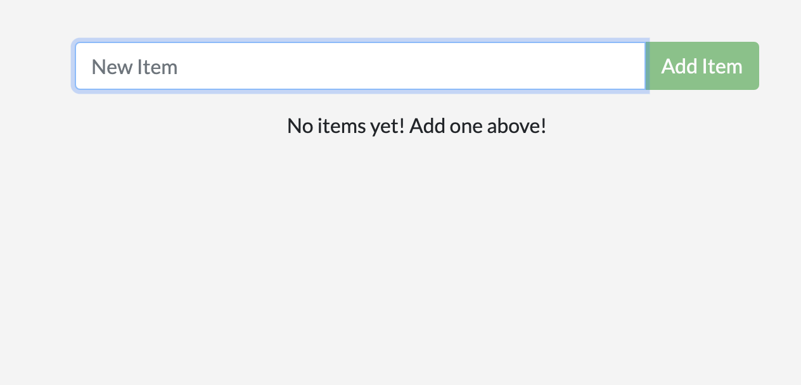

<iframe width="650" height="365" src="https://www.youtube.com/embed/nsWWQ1xoEy0?rel=0" title="YouTube video player" frameborder="0" allow="accelerometer; autoplay; clipboard-write; encrypted-media; gyroscope; picture-in-picture; web-share" allowfullscreen></iframe>

## Explanation

Crafting Docker images lays the groundwork for running applications in containers. However, configurations are paramount for fine-tuning their behavior and managing data effectively. This section delves into core techniques for overriding configurations in Docker containers.

In this concept, you will learn the following core configuration overrides:

- Environment Variables
- Volume Mounts
- Entrypoint vs. Command

## Environment variables

#### Purpose:
- Influence a container's behavior at runtime by providing key-value pairs.

#### Benefits:

Decouples configuration from the image, making it easier to manage different environments.
- Injects configuration details without modifying the application code.

#### Usage:

- `-e` flag with `docker run`: Sets a variable during container creation (e.g., `docker run -e DB_HOST=localhost my-image`).
- `ENV` instruction in `Dockerfile`: Defines a variable within the image itself (e.g., `ENV DB_HOST=localhost`).
- `.env` file: Stores environment variables in a file loaded during build (`docker build --build-arg VAR_NAME=VAR_VALUE .`).


## Volume Mounts

#### Purpose:
- Persist data used by containers, preventing data loss after container restarts.
- Maps a host directory to a container directory (e.g., docker run -v /host/data:/app/data my-image).

#### Benefits:
- Preserves application data between container restarts.
- Enables sharing data between containers mounted to the same host directory.


## Entrypoint vs. Command

#### Purpose:
- Define the startup process for a container.

#### ENTRYPOINT:
- Specifies the executable that runs at startup (typically a static definition).
- Defined using the ENTRYPOINT instruction in a Dockerfile.

#### CMD:
- Defines the default arguments passed to the executable specified by ENTRYPOINT.
- Defined using the CMD instruction in a Dockerfile (or with docker run).
- Can be overridden during container creation with docker run.

#### Key Difference:
- ENTRYPOINT defines the executable, while CMD defines the default arguments for that executable.

## Try it now

In this hands-on, you'll see how to configure your existing Dockerfile for a todo list application with environment variable.


## Setup

[Download this ZIP file](https://github.com/docker/getting-started-todo-app/blob/build-image-from-scratch/app.zip) and extract the contents into a directory on your machine.


### Step 1. Modify your `src/index.js` file 

Let's modify the `src/index.js` file - the entry point of your Node application to demonstrate overriding configurations using environment variables and show the overridden value:

```diff
const express = require('express');
const app = express();
const db = require('./persistence');
const getItems = require('./routes/getItems');
const addItem = require('./routes/addItem');
const updateItem = require('./routes/updateItem');
const deleteItem = require('./routes/deleteItem');

// Access the PORT environment variable (default to 3000)
const port = process.env.PORT || 3000;

app.use(express.json());
app.use(express.static(__dirname + '/static'));

app.get('/items', getItems);
app.post('/items', addItem);
app.put('/items/:id', updateItem);
app.delete('/items/:id', deleteItem);

db.init().then(() => {
  console.log(`Database connection initialized. Listening on port ${port}`);
  app.listen(port, () => console.log('Server listening!'));
}).catch((err) => {
  console.error(err);
  process.exit(1);
});

const gracefulShutdown = () => {
  db.teardown()
    .catch(() => {})
    .then(() => process.exit());
};

process.on('SIGINT', gracefulShutdown);
process.on('SIGTERM', gracefulShutdown);
process.on('SIGUSR2', gracefulShutdown); // Sent by nodemon
```

In the `index.js` file, we added a line to retrieve the value of the PORT environment variable using `process.env.PORT`.
If the PORT environment is not set, it defaults to `3000`.

Inside the `.then` block of `db.init`, we've modified the log message to include the port number:

```diff
 console.log(`Database connection initialized. Listening on port ${port}`);
```

This will display the actual port the server is listening on, whether it's the default (3000) or an overridden value from the environment variable.

 

### Step 2. Create a file named Dockerfile

Create a file named Dockerfile in the same folder as the file package.json

```diff
FROM node:20-alpine
WORKDIR /app
COPY package*.json ./
RUN yarn install --production
COPY . .
EXPOSE 8080
ENTRYPOINT ["node", "./src/index.js"]
```

In this Dockerfile, we defined the PORT environment variable.


### Step 3. Build the Image:

Open a terminal in the directory containing your modified Dockerfile and run:

```console
docker build -t myapp .
```

### Step 4. Run the Container (with Configurations):

Now, let's explore how to leverage environment variable.


```console
docker run -p 8080:8080  \
  -e PORT=8080
  myapp
```

- `-p 8080:8080`: Maps container port (default 3000) to host port 8080.
- `-e PORT=8080`: Sets the PORT environment variable to 8080 within the container, overriding the default.

Run the modified `src/index.js` code. If the PORT environment variable is set, the console output will show the overridden port number during startup. This confirms that the environment variable is being used effectively.

### Step 5. Verify if the app is up and running

You can verify if the app is up and running by visiting `http://localhost:8080`



## Additional resources

- [Build Variables](https://docs.docker.com/build/building/variables/)
- [Bind Mounts](https://docs.docker.com/storage/bind-mounts/)
- [Ways to set environment variables with Compose](https://docs.docker.com/compose/environment-variables/set-environment-variables/)

Now that you have learned about overriding container defaults, it's time to learn how to persist container data.


