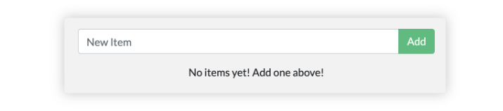

<iframe width="650" height="365" src="https://www.youtube.com/embed/nsWWQ1xoEy0?rel=0" title="YouTube video player" frameborder="0" allow="accelerometer; autoplay; clipboard-write; encrypted-media; gyroscope; picture-in-picture; web-share" allowfullscreen></iframe>

## Explanation

In this concept, you will learn the following:
- How to persist data using named volume
- How to persist data using Bind Mount

By default, Docker isolates all container content – code, data, and configuration – from your local filesystem. When you remove a container, all its content disappears. 


## Try it out

In this hands-on, you will see how to persist data between containers using Bind Mounts
### Setup

[Download this ZIP file](https://github.com/docker/getting-started-todo-app/blob/build-image-from-scratch/app.zip) and extract the contents into a directory on your machine.

### Step 1. Create a file named Dockerfile

Create a file named Dockerfile in the same folder as the file package.json

```diff
FROM node:20-alpine
WORKDIR /app
COPY package*.json ./
RUN yarn install --production
COPY . .
EXPOSE 3000
CMD ["node", "./src/index.js"]
```

### Step 2. Build the Image

Open a terminal in the directory containing your modified Dockerfile and run:

```console
docker build -t myapp .
```

### Step 3. Run the Container


```console
docker run -dp 3000:3000 \
 -w /app -v "$(pwd):/app" \
  myapp \
  sh -c "yarn install && yarn run dev"
```

- `-dp 3000:3000` - Run in detached (background) mode and create a port mapping
- `w /app` - sets the container's present working directory where the command will run from
- `-v "$(pwd):/app"` - bind mount (link) the host's present getting-started/app directory to the container's /app directory. Note: Docker requires absolute paths for binding mounts, so in this example we use pwd for printing the absolute path of the working directory, i.e. the app directory, instead of typing it manually
- `myapp` - the image to use. Note that this is the base image for our app from the Dockerfile
- `sh -c "yarn install && yarn run dev"` - the command. We're starting a shell using sh (alpine doesn't have bash) and running yarn install to install all dependencies and then running yarn run dev. If we look in the package.json, we'll see that the dev script is starting nodemon.

### Step 4. Watch the logs

```
 docker logs -f <container-id>
```

### Modify the app

Let's make a change to the app. In the `src/statis/js/index.js file, let's change the "Add Item" button to simply say "Add". This change will be on line 109 - remember to save the file.

```diff
 -                         {submitting ? 'Adding...' : 'Add Item'}
 +                         {submitting ? 'Adding...' : 'Add'}
```

Simply refresh the page (or open it) and you should see the change reflected in the browser almost immediately. It might take a few seconds for the Node server to restart, so if you get an error, just try refreshing after a few seconds.



Using bind mounts is very common for local development setups. The advantage is that the dev machine doesn't need to have all of the build tools and environments installed. With a single docker run command, the dev environment is pulled and ready to go. 

## Additional resources

- [Persist container data](https://docs.docker.com/guides/walkthroughs/persist-data/)
- [Run multi-container applications](https://docs.docker.com/guides/walkthroughs/multi-container-apps/)

Now that you have learned about persisting container data, it's time to learn how to share local files with containers.


