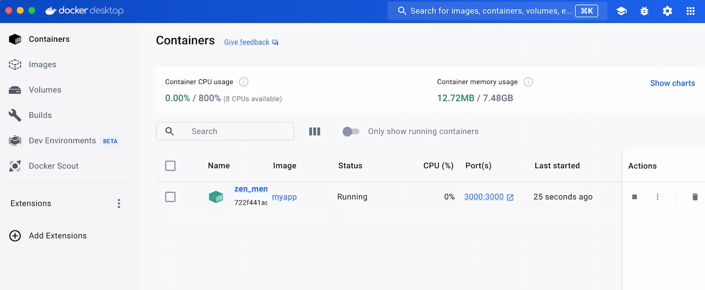

<iframe width="650" height="365" src="https://www.youtube.com/embed/nsWWQ1xoEy0?rel=0" title="YouTube video player" frameborder="0" allow="accelerometer; autoplay; clipboard-write; encrypted-media; gyroscope; picture-in-picture; web-share" allowfullscreen></iframe>

## Explanation

In this concept, you will learn the following:

- `Exposing Ports`: Making ports within a container accessible for potential connection.
- `Publishing Ports`: Mapping a container port to a specific port on the host machine,

## Understanding Exposing vs. Publishing

Imagine a containerized application that runs a web server. This server listens on a specific port (usually port 80) to handle incoming requests.

- `Exposing a Port`: This is like declaring the web server's intention to listen on port 80. It doesn't make the port accessible from outside the container yet. Think of it as informing Docker about the relevant port.
- `Publishing a Port`: This is like setting up a forwarding rule. You map the container's port 80 to a specific port on your host machine (e.g., port 8080). Now, any traffic sent to port 8080 on the host machine gets routed to the container's port 80, making the web server accessible externally.

## Exposing Ports

There are two ways to expose ports in Docker:

### 1. Using the `EXPOSE` instruction in a `Dockerfile`

This is the preferred approach. Within your Dockerfile, add a line for each port you want to expose, following the format:

```diff
EXPOSE 80
```

This tells Docker that the application listens on port 80.

### 2. Using the `--expose` flag with `docker run`

While building the image isn't required, you can expose a port during container creation using the `--expose` flag:
```console
docker run --expose 80 my-image
```

This exposes port 80 within the newly created container.

Note: Exposing a port does not automatically publish it.

## Publishing Ports

By default, when you create or run a container using docker create or docker run, the container doesn't expose any of its ports to the outside world. Use the `--publish` or `-p` flag to make a port available to services outside of Docker. This creates a firewall rule in the host, mapping a container port to a port on the Docker host to the outside world. 

Publishing ports happens during container creation using the -p (or --publish) flag with `docker run`. The syntax is:

```console
docker run -p HOST_PORT:CONTAINER_PORT my-image
```

- `HOST_PORT`: The port number on your host machine where you want to receive traffic.
- `CONTAINER_PORT`: The port number within the container that's listening for connections.

For example, to publish the container's port 80 to host port 8080:

```console
docker run -p 8080:80 my-image
```

Now, any traffic sent to port 8080 on your host machine will be forwarded to port 80 within the container.

## Benefits of Publishing Ports

- `Accessibility`: Makes containerized applications accessible from the host machine or even externally (if your host has a publicly routable IP).
- `Isolation`: Maintains isolation between containers by mapping ports individually.

## Try it now

In this hands-on, you'll see how to build and run a container with published port in order to acces it via a web browser.

## Setup

[Download this ZIP file](https://github.com/docker/getting-started-todo-app/blob/build-image-from-scratch/app.zip) and extract the contents into a directory on your machine.


### Step 1. Create a file named Dockerfile 

Create a file named `Dockerfile` in the same folder as the file `package.json`

```diff
FROM node:20-alpine
WORKDIR /app
COPY . .
RUN yarn install --production
EXPOSE 3000
CMD ["node", "./src/index.js"]
```

### Step 2. Build the Image

Open a terminal in the directory containing your Dockerfile and run the following command:

```console
docker build -t myapp .
```

Replace my-fastapi-app with your desired image name if you prefer.

### Step 3. Run the Container with Published Port

Start the container, publishing container port `8080` to host port `5000`:

```console
docker run -p 3000:3000 myapp
```

- The first `3000` refers to the container port. This is the port that the application inside the container listens on for incoming connections. (Usually port 3000 is used for web applications, but it can be any port)
- The second `3000` refers to the host port. This is the port on your local machine that will be used to access the application running inside the container. So, by mapping container port 3000 to host port 3000, you're essentially creating a tunnel between these ports.


### Step 4. Access the Application

Assuming your application runs on port `3000` within the container, you should be able to access it from your host machine by opening a web browser and navigating to `http://localhost:3000`.

Open `Docker Desktop Dashboard` > `Containers`, choose the right container and click the ports to access the application on the browser.



> **Important Note**
>
> If your application listens on a different port within the container (In case you modified the port number under EXPOSE in the Dockerfile), update the published port mapping accordingly in the docker run command.
{ .information }


## Additional resources

- [Docker Container Port](https://docs.docker.com/reference/cli/docker/container/port/)
- [Published Ports](https://docs.docker.com/network/#published-ports)

Now that you have learned about publishing and exposing ports, it's time to learn how to configure containers..


