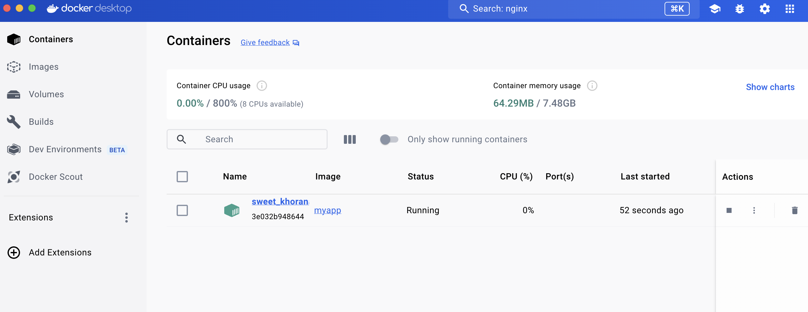

<iframe width="650" height="365" src="https://www.youtube.com/embed/nsWWQ1xoEy0?rel=0" title="YouTube video player" frameborder="0" allow="accelerometer; autoplay; clipboard-write; encrypted-media; gyroscope; picture-in-picture; web-share" allowfullscreen></iframe>

## Explanation

Docker allows you to package applications with all their dependencies into standardized units called containers. These containers, when run, provide process isolation. This means each container has its own:

- File System: Independent of the host and other containers. It can contain the application code, libraries, and configurations needed to run the application.
- Networking: Containers can be configured to communicate with each other or the outside world through isolated networks.
- Process Tree: Each container has its own set of running processes, separate from the host and other containers. This isolation ensures applications within containers don't interfere with each other or the host system.

By leveraging process isolation, Docker empowers you to:

- Run multiple applications simultaneously: Each container operates independently, preventing conflicts between applications.
- Deploy applications consistently: The containerized environment ensures applications run the same way regardless of the host machine.
- Improve security: Isolation helps prevent applications from accessing or modifying unauthorized resources on the host.

Now that you understand the core concept, let's dive into creating and running your very first Docker container!

## Try it now

In this hands-on, you'll see how to run a Docker container using `docker run` command: 

### Setup

[Download this ZIP file](https://github.com/docker/getting-started-todo-app/blob/build-image-from-scratch/app.zip) and extract the contents into a directory on your machine.

### Step 1. Create a file named Dockerfile

Create a file named Dockerfile in the same folder as the file package.json

```diff
FROM node:20-alpine
WORKDIR /app
COPY package*.json ./
RUN yarn install --production
COPY . .
EXPOSE 3000
CMD ["node", "./src/index.js"]
```

### 2. Build the Image

Open a terminal in the directory containing your modified Dockerfile and run:

```console
docker build -t myapp .
```

### 3. Run the Container


```console
docker run myapp
```

### 4. Verify if the container is running


```console
docker ps
CONTAINER ID   IMAGE     COMMAND                  CREATED         STATUS         PORTS      NAMES
3e032b948644   myapp     "docker-entrypoint.s…"   2 minutes ago   Up 2 minutes   3000/tcp   sweet_khorana
```

The output of the `docker ps` command shows information about the containers running on your system. Let's break down what each column means:

- **CONTAINER ID**: This is a unique identifier for the container. You can use this ID to manage the container with other Docker commands like docker stop or docker start.
- **IMAGE**: The name of the Docker image used to create the container. In this case, the image name is myapp.
- **COMMAND**: The command that is being executed inside the container. Here, it shows "docker-entrypoint.sh ...", which is likely the default entrypoint defined in the Dockerfile for the myapp image.
- **CREATED**: This shows how long ago the container was created. In this case, it was created 2 minutes ago.
- **STATUS**: This indicates the current state of the container. Here, it shows Up 2 minutes, which means the container is running and has been up for 2 minutes.
- **PORTS**: This column displays the ports that are mapped between the container and the host machine. The output shows `3000/tcp`, which means port `3000` inside the container is mapped to port `3000` on your host machine. This allows you to access the container's service from the host by going to `http://localhost:3000` (assuming the container runs a web service on port `3000`).
- **NAMES**: This shows the user-assigned name for the container. Here, the container is named `sweet_khorana`.
Alternatively, you can view the running container using Docker Desktop.



## Additional resources

- [Running containers](https://docs.docker.com/engine/reference/run/)
- [Start containers automatically](https://docs.docker.com/config/containers/start-containers-automatically/)


Now that you have learned about running the containers, it's time to learn how to publish and expose ports.


