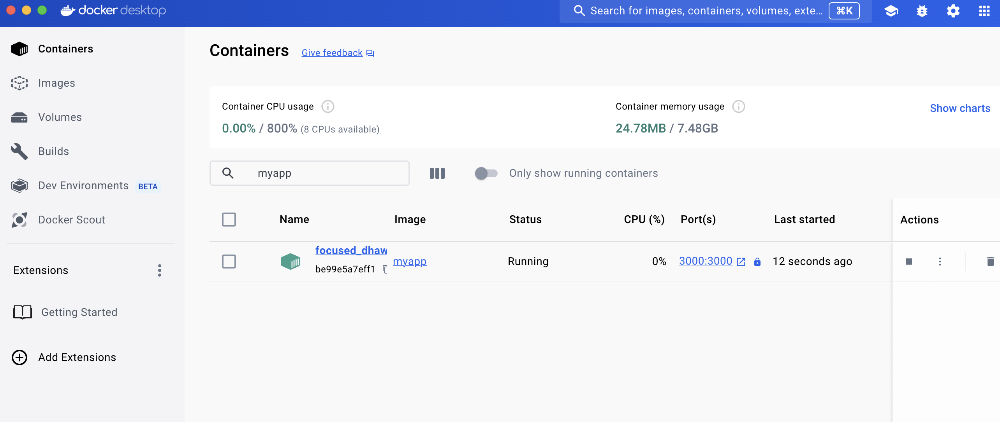
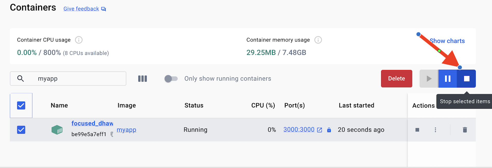
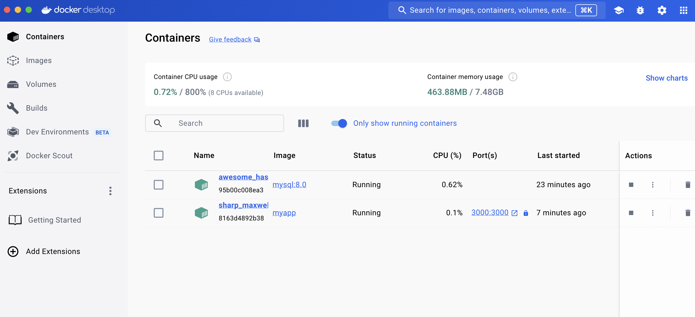

<iframe width="650" height="365" src="https://www.youtube.com/embed/nsWWQ1xoEy0?rel=0" title="YouTube video player" frameborder="0" allow="accelerometer; autoplay; clipboard-write; encrypted-media; gyroscope; picture-in-picture; web-share" allowfullscreen></iframe>

## Explanation

In this concept, you will learn the following:
- How to define the services in a YAML file
- How to run multi-container application stack using Docker Compose 

Docker Compose simplifies managing and deploying multi-container applications. It replaces complex orchestration with a single YAML file (`docker-compose.yml`) that defines your entire application stack: services, networks, and volumes. With a single command (`docker-compose up`), you can spin up all the services from this configuration.

### Benefits and Use Cases

Docker Compose offers numerous advantages:

- **Simplified Control**: Manage your entire application environment in one place, making it easier to control and replicate.
- **Efficient Collaboration**: Easily share the YAML file for smooth collaboration among developers and operations teams.
- **Rapid Development**: Quickly make changes to your environment thanks to caching and container reuse.
- **Portability**: Customize your configuration for different environments using variables in the YAML file.
- **Extensive Community**: Docker Compose benefits from a large and active community providing resources and support

Docker Compose Common Use cases:

- **Development Environments**: Quickly set up isolated development environments with all dependencies by defining them in the YAML file.
- **Automated Testing**: Create and destroy isolated testing environments with ease for automated test suites.
- **Single Host Deployments**: Although primarily focused on development and testing, Compose can be used for single-host deployments as well.

### How Docker Compose works

Docker Compose uses a YAML file (`compose.yml`) to define multi-container applications. This file specifies:

- Services: The individual components of your application.
- Networks: How services communicate with each other.
- Volumes: Persistent storage for service data.
- Secrets: Secure configuration data for services (passwords, keys).

## Try it now

In this hands-on, you'll see how to write a Docker compose file for multi-container applications.

### Setup

[Download this ZIP file](https://github.com/docker/getting-started-todo-app/blob/build-image-from-scratch/app.zip) and extract the contents into a directory on your machine.

### Step 1. Create a file named Dockerfile

Create a file named Dockerfile in the same folder as the file package.json

```diff
FROM node:20-alpine
WORKDIR /app
COPY package*.json ./
RUN yarn install --production
COPY . .
EXPOSE 3000
CMD ["node", "./src/index.js"]
```

### Step 2. Build the Image

Open a terminal in the directory containing your modified Dockerfile and run:

```console
docker build -t myapp .
```

Start the container, publishing container port `8080` to host port `5000`:

```console
docker run -p 3000:3000 myapp
```

- The first `3000` refers to the container port. This is the port that the application inside the container listens on for incoming connections. (Usually port 3000 is used for web applications, but it can be any port)
- The second `3000` refers to the host port. This is the port on your local machine that will be used to access the application running inside the container. So, by mapping container port 3000 to host port 3000, you're essentially creating a tunnel between these ports.


### Step 3. Access the Application

Assuming your application runs on port `3000` within the container, you should be able to access it from your host machine by opening a web browser and navigating to `http://localhost:3000`.

Open `Docker Desktop Dashboard` > `Containers`, choose the right container and click the ports to access the application on the browser.




### Step 4. Stopping the running container

You can stop the running container by clicking on "Stop" button on Docker Desktop dashboard.




## II. Running a Multi-container Application

### Step 5. Creating a Docker network for MySQL container

Containers are isolated by default and cannot communicate with each other unless they share a network. We'll create a network named todo-app using the following command:

```console
 docker network create todo-app
```

### Step 6. Starting the MySQL container

```console
 docker run -d \
    --network todo-app --network-alias mysql \
    -v todo-mysql-data:/var/lib/mysql \
    -e MYSQL_ROOT_PASSWORD=secret \
    -e MYSQL_DATABASE=todos \
    mysql:8.0
```

Let's break down the options used:

- `-d`: Runs the container in detached mode.
- `--network todo-app`: Connects the container to the todo-app network.
- `--network-alias mysql`: Assigns the alias mysql within the network for easier discovery by other containers.
- `-v todo-mysql-data:/var/lib/mysql`: Mounts a volume named todo-mysql-data to the /var/lib/mysql directory inside the container. This is where MySQL stores its data, ensuring data persistence even if the container restarts.
- `-e MYSQL_ROOT_PASSWORD=secret`: Sets the MySQL root password to "secret" (replace with a strong password in production).
- `-e MYSQL_DATABASE=todos`: Creates a database named "todos" within the MySQL container.
- `mysql:8.0`: Specifies the base image as MySQL version 8.0.

### Step 7. Access MySQL Database

To confirm we have the database up and running, connect to the database and verify it connects.

```console
 docker exec -it <mysql-container-id> mysql -p
```

When the password prompt comes up, type in secret. In the MySQL shell, list the databases and verify you see the todos database.

```console
 mysql> SHOW DATBASES;
```

You should see output that looks like this:

```console
 +--------------------+
| Database           |
+--------------------+
| information_schema |
| mysql              |
| performance_schema |
| sys                |
| todos              |
+--------------------+
5 rows in set (0.00 sec)
```

Hooray! We have our todos database and it's ready for us to use!

To exit the sql terminal type exit in the terminal.


### Step 8: Running App with MySQL

The following command connects the Node application to the MySQL database:

```console
docker run -dp 3000:3000 \
  -w /app -v "$(pwd):/app" \
  --network todo-app \
  -e MYSQL_HOST=mysql \
  -e MYSQL_USER=root \
  -e MYSQL_PASSWORD=secret \
  -e MYSQL_DB=todos \
  myapp \
  sh -c "yarn install && yarn run dev"
```




### Step 9. Verify if the database gets updated

```console
mysql> show databases;
+--------------------+
| Database           |
+--------------------+
| information_schema |
| mysql              |
| performance_schema |
| sys                |
| todos              |
+--------------------+
5 rows in set (0.00 sec)
```

Run the following query to verify if the items are written to the database.

```console
mysql> show tables;
+-----------------+
| Tables_in_todos |
+-----------------+
| todo_items      |
+-----------------+
1 row in set (0.00 sec)
```

```console
mysql> select * from todo_items;
+--------------------------------------+---------------+-----------+
| id                                   | name          | completed |
+--------------------------------------+---------------+-----------+
| 03a949cb-7a6a-4846-96a5-1569ca390d7a | Watch Netflix |         0 |
| 2275bd3d-7e4c-4c30-9436-c11cf1e20efb | Buy Grocery   |         0 |
| b32f1053-be0c-468c-9521-66ae72349d75 | Pick up kid   |         0 |
+--------------------------------------+---------------+-----------+
3 rows in set (0.01 sec)

mysql>
```

### Step 10. Writing a Docker Compose YAML file

Let us convert the following `docker run` command into YAML file:

```console
docker run -dp 3000:3000 \
  -w /app -v "$(pwd):/app" \
  --network todo-app \
  -e MYSQL_HOST=mysql \
  -e MYSQL_USER=root \
  -e MYSQL_PASSWORD=secret \
  -e MYSQL_DB=todos \
  myapp \
  sh -c "yarn install && yarn run dev"
```

First, let's define the service entry and the image for the container. We can pick any name for the service. The name will automatically become a network alias, which will be useful when defining our MySQL service.

```diff
services:
  app:
    image: myapp
    command: sh -c "yarn install && yarn run dev"
```

Let's migrate the -p 3000:3000 part of the command by defining the ports for the service. We will use the short syntax here, but there is also a more verbose long syntax available as well.

```diff
services:
  app:
    image: myapp
    command: sh -c "yarn install && yarn run dev"
  ports:
    - 3000:3000
```

Next, we'll migrate both the working directory (-w /app) and the volume mapping (-v "$(pwd):/app") by using the working_dir and volumes definitions. Volumes also has a short and long syntax.

```diff
services:
  app:
    image: myapp
    command: sh -c "yarn install && yarn run dev"
  ports:
    - 3000:3000
  working_dir: /app
  volumes:
    - ./:/app
```
Finally, we need to migrate the environment variable definitions using the environment key.

```diff
services:
  app:
    image: myapp
    command: sh -c "yarn install && yarn run dev"
  ports:
    - 3000:3000
  working_dir: /app
  volumes:
    - ./:/app
  environment:
    MYSQL_HOST: mysql
    MYSQL_USER: root
    MYSQL_PASSWORD: secret
    MYSQL_DB: todos
```

### Step 11. Defining the MySQL Service

Now, it's time to define the MySQL service. The command that we used for that container was the following:

```console
docker run -d \
  --network todo-app --network-alias mysql \
  -v todo-mysql-data:/var/lib/mysql \
  -e MYSQL_ROOT_PASSWORD=secret \
  -e MYSQL_DATABASE=todos \
  mysql:8.0
```

We will first define the new service and name it mysql so it automatically gets the network alias. We'll go ahead and specify the image to use as well.

```diff
services:
  app:
    # The app service definition
  mysql:
    image: mysql:8.0
```

Next, we'll define the volume mapping. When we ran the container with docker run, the named volume was created automatically. However, that doesn't happen when running with Compose. We need to define the volume in the top-level volumes: section and then specify the mountpoint in the service config. By simply providing only the volume name, the default options are used. 

```diff
services:
  app:
    # The app service definition
  mysql:
    image: mysql:8.0
    volumes:
      - todo-mysql-data:/var/lib/mysql

volumes:
  todo-mysql-data:
```

Finally, we only need to specify the environment variables.

```diff
services:
  app:
    # The app service definition
  mysql:
    image: mysql:8.0
    volumes:
      - todo-mysql-data:/var/lib/mysql
    environment: 
      MYSQL_ROOT_PASSWORD: secret
      MYSQL_DATABASE: todos

volumes:
  todo-mysql-data:
```

Here's the final Docker compose file:

```diff
services:
  app:
    image: myapp
    command: sh -c "yarn install && yarn run dev"
    ports:
      - 3000:3000
    working_dir: /app
    volumes:
      - ./:/app
    environment:
      MYSQL_HOST: mysql
      MYSQL_USER: root
      MYSQL_PASSWORD: secret
      MYSQL_DB: todos

  mysql:
    image: mysql:8.0
    volumes:
      - todo-mysql-data:/var/lib/mysql
    environment: 
      MYSQL_ROOT_PASSWORD: secret
      MYSQL_DATABASE: todos

volumes:
  todo-mysql-data:
```

### Step 11. Running our Application Stack

Start up the application stack using `docker compose up` command. Ensure that you have no other copies of app/db running on your system with the same port.

```console
docker compose up -d
```

When you run this command, you should see output like this:

```diff
[+] Running 3/3
⠿ Network app_default    Created                                0.0s
⠿ Container app-mysql-1  Started                                0.4s
⠿ Container app-app-1    Started                                0.4s
```

You'll notice that the volume was created as well as a network! By default, Docker Compose automatically creates a network specifically for the application stack (which is why we didn't define one in the compose file).

Let's look at the logs using the docker compose logs -f command. You'll see the logs from each of the services interleaved into a single stream. This is incredibly useful when you want to watch for timing-related issues. The -f flag "follows" the log, so will give you live output as it's generated.

If you don't already, you'll see output that looks like this...

```
mysql_1  | 2022-11-23T04:01:20.185015Z 0 [System] [MY-010931] [Server] /usr/sbin/mysqld: ready for connections. Version: '8.0.31'  socket: '/var/run/mysqld/mysqld.sock'  port: 3306  MySQL Community Server - GPL.
app_1    | Connected to mysql db at host mysql
app_1    | Listening on port 3000
```

The service name is displayed at the beginning of the line (often colored) to help distinguish messages. If you want to view the logs for a specific service, you can add the service name to the end of the logs command (for example, `docker compose logs -f myapp`).

At this point, you should be able to open your app and see it running. And hey! We're down to a single command!


