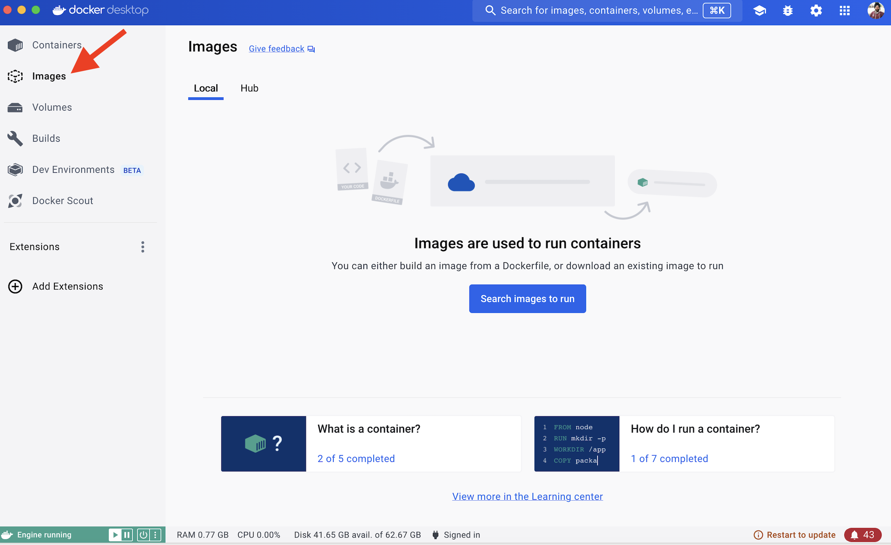
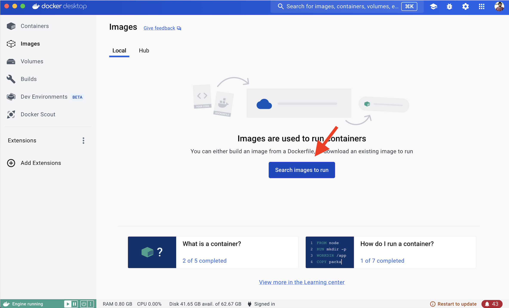
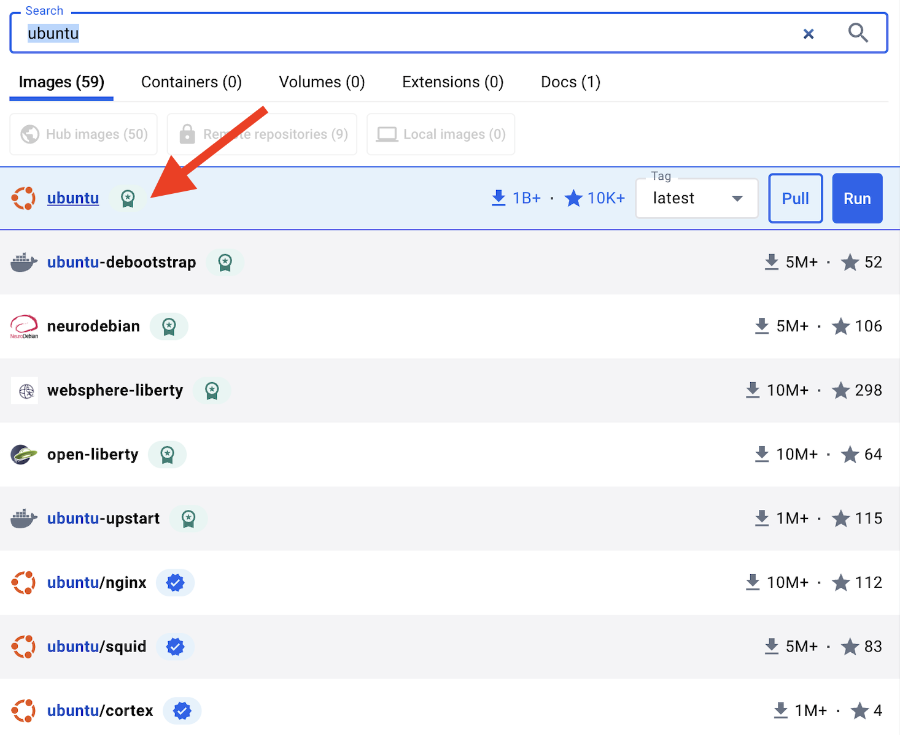
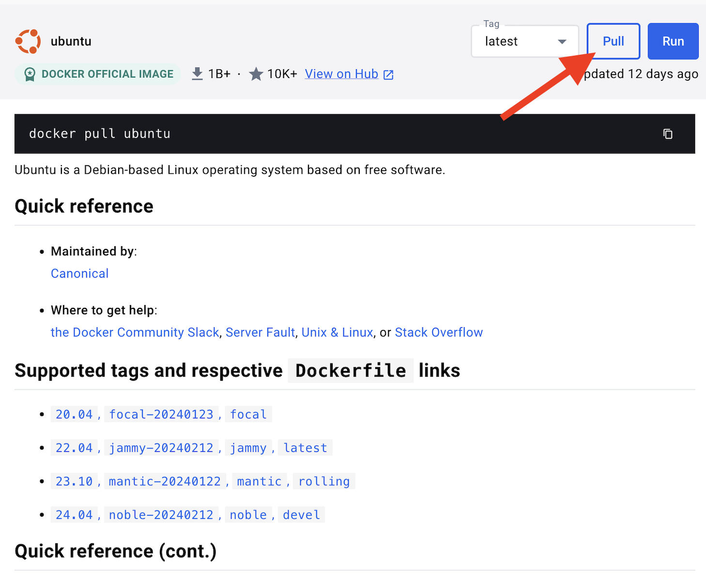
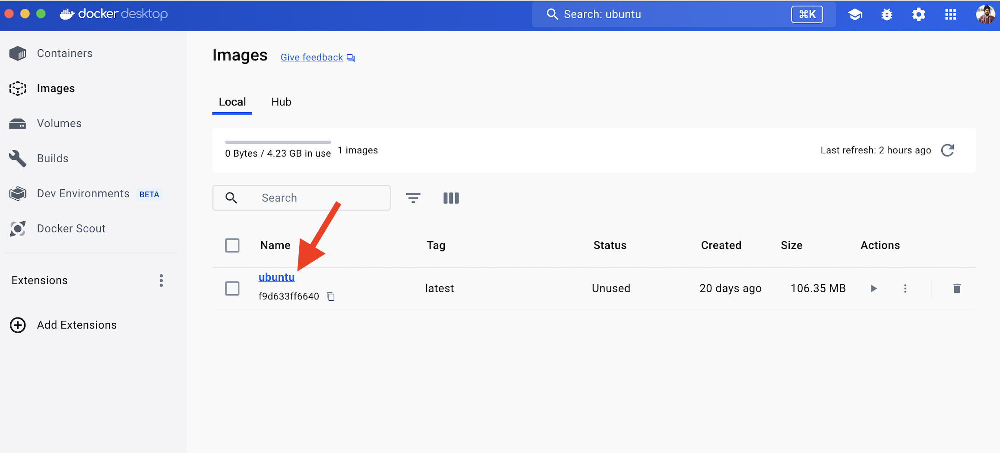
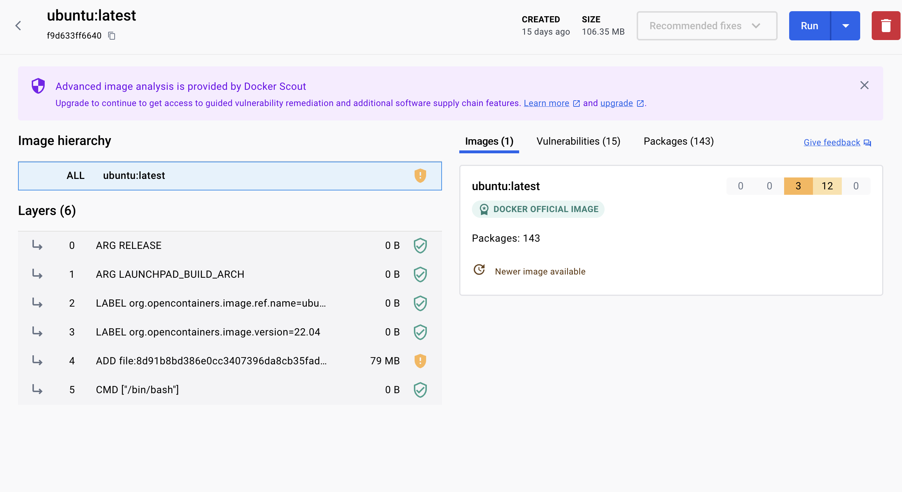

<iframe width="650" height="365" src="https://www.youtube.com/embed/nsWWQ1xoEy0?rel=0" title="YouTube video player" frameborder="0" allow="accelerometer; autoplay; clipboard-write; encrypted-media; gyroscope; picture-in-picture; web-share" allowfullscreen></iframe>

## Explanation

An `image` is a read-only template with instructions for creating a Docker container. A `container image` is a lightweight, standalone, executable package of software that includes everything needed to run an application: code, runtime, system tools, system libraries and settings. These lightweight packages act as the blueprints for creating containers, the isolated environments that house your application's code and dependencies.

Container images are incredibly lightweight and portable. Since they contain everything a container needs to run, you can easily move an image from one system to another, ensuring your application runs flawlessly across different environments. This makes them ideal for modern development and deployment workflows, where agility and ease of use are paramount.

Most often, an image is based on another image, with some additional customization. For example, you may build an image which is based on the `ubuntu` image, but installs the Apache web server and your application, as well as the configuration details needed to make your application run. You might create your own images or you might only use those created by others and published in a registry. 

To build your own image, you create a Dockerfile with a simple syntax for defining the steps needed to create the image and run it. Each instruction in a Dockerfile creates a layer in the image. When you change the Dockerfile and rebuild the image, only those layers which have changed are rebuilt. This is part of what makes images so lightweight, small, and fast, when compared to other virtualization technologies.

### Docker Image Layers

Docker images are built using layers, and each command in a Dockerfile results in a new layer. These layers are cached and can be reused if the command and its context haven't changed since the last build. However, changes in dependencies or source code can invalidate the cache for subsequent commands. 

The layered approach makes it efficient to share and distribute Docker images. If someone has already pulled the layers you need, Docker only needs to pull the new or changed layers when you fetch the image.

## Try it now

In this hands-on, you will see how to search and pull a Docker image using Docker Desktop to view it's layers.

### Search and Pull a Docker Image

Use the following instructions to search and pull  a Docker image..

### Step 1. Open Docker Desktop dashboard and click on "Images".

### Step 2. Click "Search images to run" button.

### Step 3. Type `ubuntu` in the search window and then select "Ubuntu".

### Step 4. Click the `Pull` button

 

### Step 5. View the pulled `ubuntu` image

### Step 6.  View the Ubuntu Image Layers

Click on "ubuntu" image to view its image layers.

Docker image layers represent the sequential changes made to a container's filesystem during the build process. Each instruction in a Dockerfile, like installing software, copying files, or setting environment variables, results in a new layer being added to the image. This layered approach ensures that images are modular, with changes or updates only affecting specific layers, promoting faster rebuilds and efficient storage. Base layers can be shared across different images, and the overall image becomes a portable, self-contained package with everything needed to run the application within a container.

In this walkthrough, you learned how to search and pull a Docker image. In addition to pulling a Docker image, you also learned about the layers of Docker Image.

## Additional resources

- [Explore the Images view in Docker Desktop](https://docs.docker.com/desktop/use-desktop/images/)
- [Packaging your software](https://docs.docker.com/build/building/packaging/)
- [Explore the Containers view in Docker Desktop](https://docs.docker.com/desktop/use-desktop/container/)



